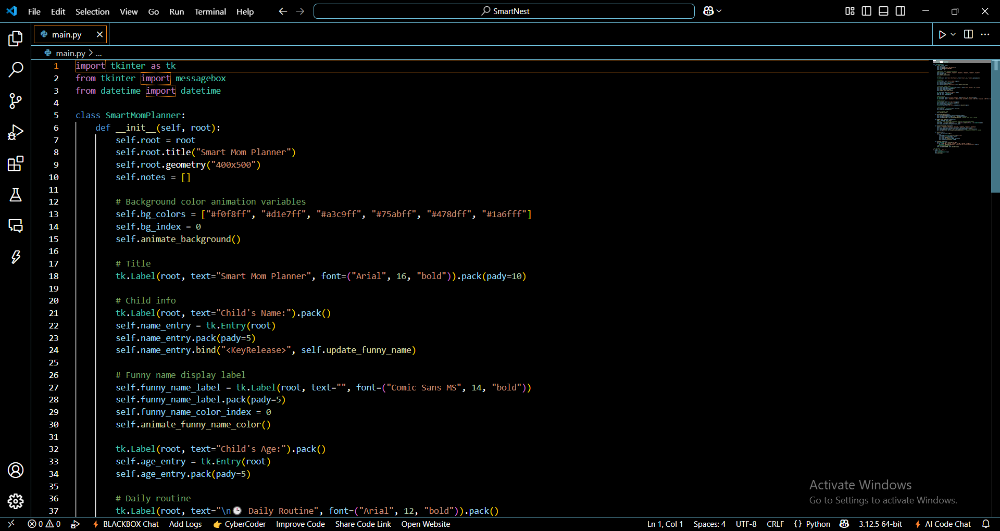

# 🌟 Smart Mom Planner

The **Smart Mom Planner** is a fun and interactive desktop application built with **Python** and **tkinter** to help moms organize daily activities, add personalized notes, and set reminders for their children. The app includes features like funny name generation for the child, dynamic background color animation, and automated routine reminders.

---

## ✨ Features

- 🎨 **Dynamic Background Color Animation**: The background color changes every second, adding a fun and dynamic feel to the app.
- 😄 **Funny Name Generator**: As you type your child's name, it creates a funny version by alternating uppercase and lowercase letters.
- 👶 **Child's Information**: Input your child’s name and age for personalized interaction.
- ⏰ **Daily Routine Reminders**: The app automatically displays reminders at specific times for daily activities such as breakfast, nap, lunch, playtime, dinner, and bedtime.
- 📝 **Notes Section**: Add personalized notes with timestamps, and view them in a list.
- 🌈 **Colorful Interface**: The app features a colorful interface with changing text colors to keep it fun and engaging.

---

## 📸 Screenshots
### 🧩 GUI Interface

  
*Main interface of Smart Mom Planner.*

### 💻 Code Preview

  
*Sample Python code driving the application.*


### 💻 Code Preview

![Code Screenshot]WhatsApp Image 2025-05-05 at 6.55.03 AM (1).jpeg)  
*Sample Python code driving the application.*


---

## 🛠 Requirements

- **Python 3.x** (tested with Python 3.12)
- **tkinter** library (comes pre-installed with Python)

---

## 🚀 How to Run

1. Clone the repository or download the `main.py` file.
2. Open a terminal or command prompt in the project folder.
3. Run the following command:

```bash
python main.py


